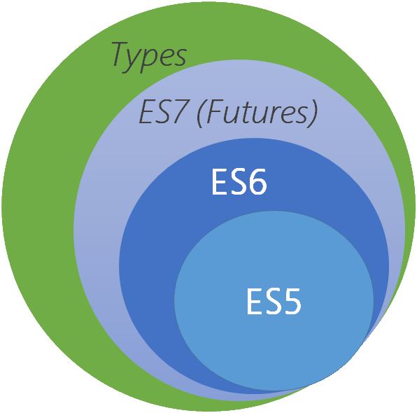
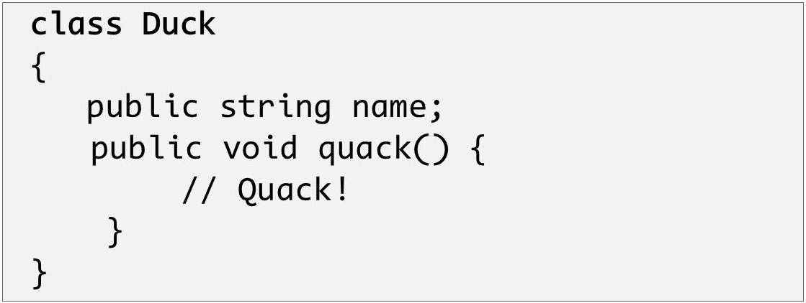
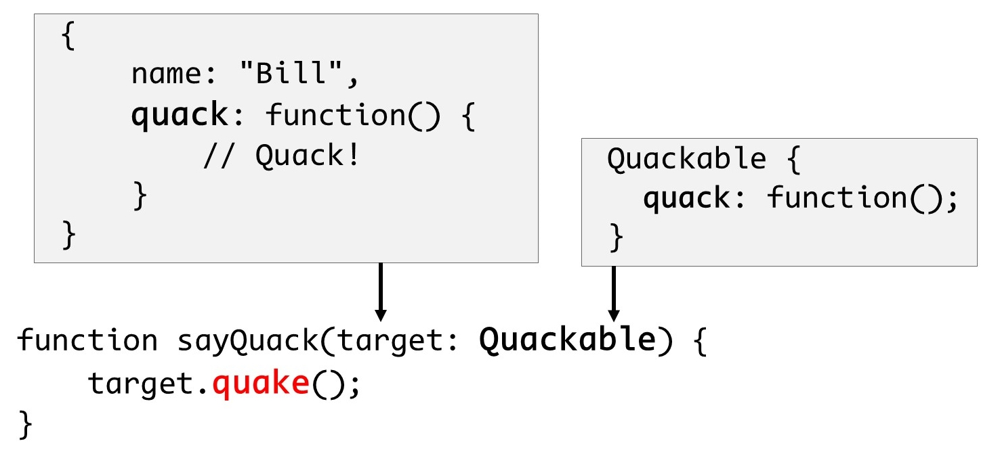
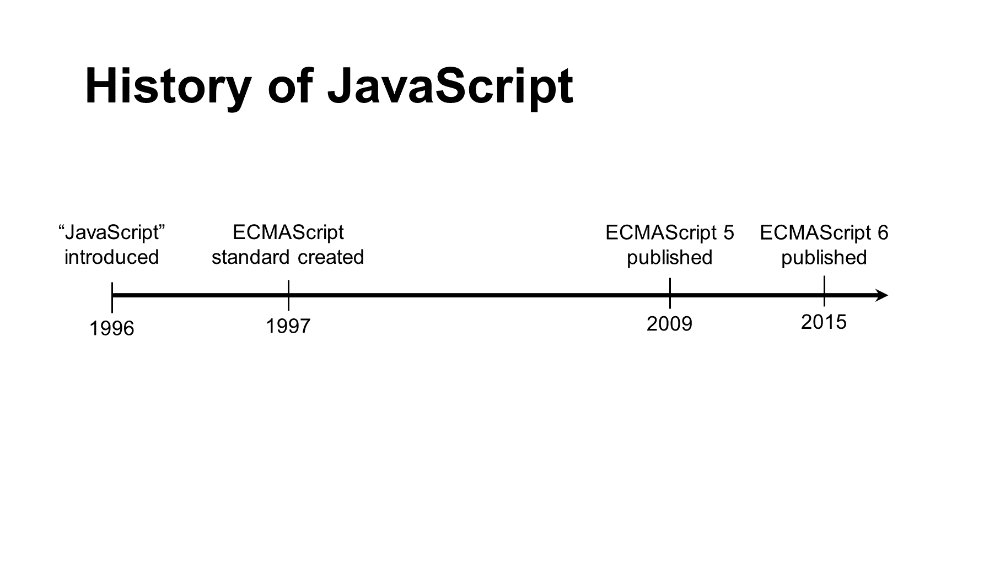
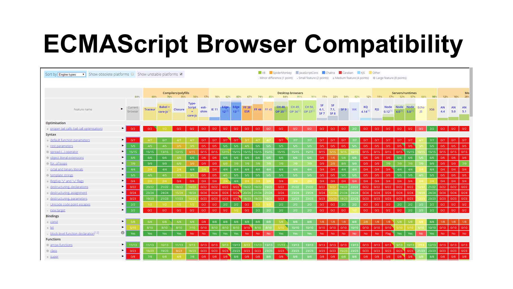

# Introduction {#introduction}

## What is TypeScript? {#what-is-typescript}

In this book, I'm going to show you everything you need to know in order to write applications using TypeScript.  In this section, I'm going to start with the basics and explain what, exactly, TypeScript is.

Put simply, TypeScript is a superset of the JavaScript programming language that adds the concept of static typing to the core features of JavaScript.  

{width=40%,float=right}

This is a big deal because JavaScript is - and always has been - a dynamic language.

In order to illustrate why this is a big deal, I'll quickly define what it means to be a static language or a dynamic language and how they seem, at first, to be completely opposite and incompatible things.  

{width="wide"}
| Dynamic Types  | Static Types |
|-------------------|
| Type System   | Type System     |
| Forgiving   | Rigid     |
| Great for web browser object model   | Promotes stability and maintainability     |
|-------------------|

Both dynamic and static languages rely on a type system - that is, definitions of data structures and their behaviors - to ensure that programs are correct.  It's just that the two kinds of languages validate those types in different ways.

Dynamic languages aim to be much more forgiving at development time, relying on the concept of "duck typing" to validate that a particular object can be used in a certain way.  

"Duck typing" refers to the idea that if it looks like a duck, walks like a duck, and quacks like a duck, it must be a duck...  In other words, if my code expects an object that has a method called "quack" on it, and I get an object that has a method named "quack", well that's good enough for me -- I don't need to validate anything else about that object.  The net result of this approach is that tools don't have enough information to catch errors before the application runs, for example, if I've accidentally typed the method name "quake" rather than "quack".

{width=40%,float=right}

  
This means that errors are only ever caught while the application is running... after it's too late to do anything about it.  

Statically-typed languages, on the other hand, are much more rigid.  They aim to catch development errors before the code is even executed and they do this by imposing restrictions on how you can interact with objects, forcing you to very clearly specify everything about the object that you're going to interact with.  

{width=40%,float=left}

In static typing world, you can't just call a "quack" method on any object - you first need to explicitly define a type that has that quack method, as well as any parameters that need to be passed into that method not to mention the value that the quack method will return to its callers.  Only then can you use that instance as a parameter or create an instance of that class to pass around to other objects or methods.

With all this information explicitly provided, the tooling is able to easily tell me when I've misspelled the call to the "quack" method well before my application is running -- heck, with modern tools it'll likely take less than a second for me to find out that I've done something wrong!

If it sounds like I'm making a case for one approach over the other, I'm not -- each of the typing approaches lends itself to a different set of scenarios so it quite simply depends on what you're looking to do with the language.  

But here's the thing:  who's to say you can't use both at the same time?

For better or worse, JavaScript is a dynamically typed language.  This makes it particularly suitable for dealing with the web browser object model that it was originally designed to work with.  But, JavaScript has been asked to do far more these days than what it was originally designed to do, and in some of those cases some people start to find its dynamic nature more of a curse than a gift.  In these scenarios, being able to apply static typing can have a hugely beneficial effect on the stability and maintainability of the code.  

Enter TypeScript.

TypeScript is a superset of JavaScript -- that is, it extends JavaScript with static typing capabilities;  it doesn't fundamentally change the way that JavaScript works and it especially doesn't take away any of JavaScript's powerful dynamic capabilities.  TypeScript simply allows developers to opt-in to the static typing approach whenever it will benefit them.

Let's go back to the quacking example from earlier:  JavaScript is a dynamic language, which means that I can write code that calls a "quack" method on any object and JavaScript isn't going to yell at me until runtime when it turns out that quack method doesn't actually exist.  In some cases, that may be what I want.  But, in other cases -- and that case could be 5 lines further down in the same piece of code -- maybe I want to be completely sure that the object actually has a quack method before I call it, and I don't want to wait until runtime to find out.  In that case, I'll use TypeScript's language features to make that very clear right in my code and TypeScript will validate that assertion before my code executes.

This all comes at a cost, of course - you've got to define types in order to use them, and that means writing more code.  You just have to weigh the cost of writing that code with the value of finding out about these kinds of issues before your code executes.  For many people and many scenarios, having this piece of mind is well worth the extra work of defining the types.

And, if finding out about code issues as early as possible isn't enough, having to explicitly define the types of objects you work with also tends to make your code easier to understand and maintain, especially if you have multiple developers working on the same codebase.  In cases such as these, static types tend to have an illuminating effect, helping developers understand what they can and can't do with a particular object.

But perhaps the best thing about TypeScript is that you don't always have to use static types.  While introducing static typing may help deal with a lot of different scenarios, there are still other scenarios that benefit from maintaining a completely dynamic approach, and TypeScript supports those, too.  With TypeScript, static typing is strongly encouraged, but whenever you feel the need to ditch the safety of type checking in order to take full advantage of JavaScript's dynamic roots, just let TypeScript know and it will leave you without that type-checking safety net for as long as you like.

At this point, you're likely starting to form an opinion about whether or not TypeScript sounds like a good fit for you.  If this sounds like just the thing you've been looking for, I think you're going to love this book!  If you're still hesitant about whether or not TypeScript offers enough value to make up for the extra work you'll have to do to specify all your types, I urge you to at least read the rest of this chapter to get the full picture before making up your mind.

Either way, head on to the next section where I'll get a little deeper into TypeScript's relationship with JavaScript and how you can still benefit from TypeScript even if you never take advantage of its static typing features!

## Defining "JavaScript" {#what-is-javascript}

I know I've already said it a few times, but I'm going to go ahead and say it again because it's just that important:  TypeScript is a superset of JavaScript.  And, since JavaScript is going to play such a big part in this book, I think it's pretty important to define what it is that I'm referring to when I use the term JavaScript.  

I'll start with a real quick history lesson:

The JavaScript language was first introduced in 1996 in the Netscape Navigator browser.  Soon, other browsers started implementing syntax and APIs incredibly similar to - but not exactly compatible with - Netscape's implementation and within about a year or so, the ECMA International standards body attempted to get everyone on the same page by publishing a standard which defined a common specification for all implementations to follow;  this standard was called ECMAScript.

As such, you'll often hear the JavaScript language referred to as ECMAScript, or simply "ES" followed by the version number of the standard -- for example, "ES5", "ES6", or "ES2015".  And, by the way, the ECMA group decided to reset the version numbering in the sixth version, but not until after the community had already taken to calling it "ES6", so just keep in mind that "ES6", "ES2015", and "ECMAScript 2015" all refer to the same exact thing.  Yeah, confusing, I know...

Semantics aside, and especially throughout this book, it's generally fine to use the terms JavaScript and ECMAScript interchangeably when referring to the various implementations of the language, as most implementations follow the standard close enough that the names can be used pretty synonymously.

{width=50%,float=right}

Fast-forward to today, where we've got many more browsers and other platforms that leverage JavaScript, as well as several more versions of the ECMAScript standard.  However, just because a standards body publishes a version of a standard doesn't mean every feature in that standard is immediately available in all implementations and platforms.  The reality is that some implementations already had some of the features prior to the feature being officially approved and, despite being part of the approved standard, some other features may not actually be available in all implementations for quite a while.

As a JavaScript developer, it can be incredibly frustrating to be aware of a convenient or powerful new feature that is available in the language you're using, but not being able to leverage that feature out of fear that it won't be implemented in one or more of the browsers or platforms that you must support.

Enter the world of transpilers, or tools that transform code from one language into another language.  In our example, this means the ability to write code that leverages next-generation ECMAScript features, yet compiles down to JavaScript that is fully compatible with the current generation ECMAScript implementations that are widely available today.

There are handful of popular transpilers available and each of them expose the next-generation ECMAScript features in a different way.  Some transpilers attempt to be true to the ECMAScript standard, allowing you to write your code as if the latest version of the standard were available everywhere.  Other transpilers use a syntax that is effectively a completely different language altogether.  
Regardless of what syntax you use to write your code, however, all transpilers compile that code into the JavaScript that is most compatible with all implementations that you're looking to run your application on.

As of the time of this writing, ECMAScript 2015 has only been recently ratified, which means that it will still be a while until all of its features are available everywhere you want them to be.  The good news is that, in addition to all of the static typing features that I'll be showing throughout this book, TypeScript also implements a handful of ECMAScript 2015 features as well.  In fact, I'll spend the entire first chapter of this book just showing you how to implement these ECMAScript features with TypeScript before I even get into showing you how to leverage TypeScript's static typing features.

And in this way, TypeScript definitely falls under the "transpiler" category.  More importantly, it falls into the class of transpiler that aims to remain true to the ECMAScript standard rather than the kind of transpiler that reinvents its own language.  So, when I say that "TypeScript is a superset of JavaScript", I'm referring to this idea that TypeScript starts with being as compatible with the latest ECMAScript standard as possible, and then adds even more features on top of that foundation.  

The chart I showed earlier is from an excellent website I like to refer that contains an exhaustive list of all of the ECMAScript standards and which tools, runtimes, and implementations currently support them. TypeScript is among the tools that is compared on this list and as of the time of this writing, this site states that TypeScript implements about a half of the total ECMAScript 2015 standard.  While that may seem unimpressive - especially compared to some of the other tools such as Babel - it's important to keep in mind that the real value TypeScript offers is adding static typing support to JavaScript -- as an added perk, it also implements some ES6 features as well.

Also keep in mind that TypeScript also happens to implement some of the future features defined in the next ECMAScript standard, ECMAScript 7, and that standard is not even close to being finalized yet.  I think you can expect TypeScript to continue to growing, remaining as compatible with current, approved standards while also implementing proposed features.  In other words, in addition to all of the benefits of static typing that TypeScript adds, it also helps you leverage many JavaScript features that may not otherwise be available to you.  Personally, I think that's a great deal.

For more details of the ECMAScript 2015 features that TypeScript supports and how to leverage them, check out the "ECMAScript 2015 Features" chapter of this book.

But, enough about JavaScript and ES6 - head on to the next section to get a glimpse into how you use TypeScript to implement all this static typing that I've been raving about!

## Writing your first TypeScript function {#first-typescript-function}

Over the past few sections, I've described what TypeScript is in theory, but now it's time to see it in action.  In this section I'm going to take you on a whirlwind tour of the most important features of TypeScript - the features that you'll find yourself using on a daily basis.  If you find that I'm going too fast in this section, don't worry - I'll spend the rest of this book diving into all the details so that you won't miss a thing.

In later sections, I'll show you how to install TypeScript onto your local system, but I'm going to skip that for now and start by showing you the simplest possible way to start learning TypeScript: TypeScript's free, online TypeScript editor.  This editor is a powerful tool that gives you full syntax highlighting, auto-complete capability, and compile TypeScript right in the browser

You can get to the editor by opening up your favorite browser and going to [typescriptlang.org](https://typescriptlang.org), then clicking the "play" menu item at the top of the TypeScript homepage.  

Once the page has loaded, I'll clear all the code that’s already in the editor and replace it with this snippet of JavaScript code:

{linenos=on}
~~~
function speak(value) {
    document.write(value);
}

var greeted = "World";
var greeting = "Hello, ";
var whatToSay = greeting + greeted;

speak(whaToSay);
~~~
	
Right off the bat, the TypeScript editor is already helping spot problems in this code:  turns out I spelled the variable name wrong in the last line!  That's simple enough to fix - I'll just add the missing character.

With that fixed, let's look at what this snippet is doing:  we've got a function called speak which simply writes out the variable to the document, and a couple of variables that we're adding together to produce the full text that we are passing to the speak function.  

Seems straight-forward enough -- what could go wrong, right?
As it turns out, plenty.  For instance, what happens when I change the value of the greeted variable to a different type, such as a number?

    var greeted = 42;
	
Actually, that's fine, because JavaScript is smart enough to convert that number back into a string when the number is added to a string.  And, since the result will always be a string type and never be ambiguous, TypeScript is happy as well.  But, what if I turned BOTH values into numbers?  Then the resulting value would be a number!

    var greeted = 42;
    var greeting = 1;
	
Now, we've gone from passing a string value into the `speak()` function to passing a number value.  True to JavaScript's dynamic nature, it doesn't care - it just goes ahead and converts it to a string in order to render it to the browser.  TypeScript is also happy, since the number can be converted to a string.

Here's the problem: that's not what I intended to happen.  I only ever intended for the speak method to accept a string value, but JavaScript doesn't let me express that intent.  The only way I can ever guarantee that the parameter value is a string is to write code to check it at runtime.

Here's where TypeScript comes in handy.  If I only ever want strings to be passed in, I can say so by explicitly saying that the `value` parameter is a string using this syntax:

    speak(value: string)

As soon as I add this type, TypeScript immediately notices that I am trying to pass a number value as a parameter to the speak function on the last line of code and underlines that code in red to indicate the error.  When I hover over the error, TypeScript tells me that I'm trying to pass in a number when the function expects a string.

TypeScript is raising this error because it thinks that the variable I'm passing is a number.  TypeScript thinks the variable is a number because it was initialized as the result of adding two numbers together.  To make this error go away, I need to tell TypeScript that the `whatToSay` variable is, indeed, a string.  I can do that using the same syntax that I just used to define the string type on the method parameter: right after the variable name, and before the assignment.

    var whatToSay: string = greeting + greeted;
	
Of course, that didn't actually solve the problem, it just gave TypeScript more information to figure out where the problem was.  Remember - the real problem is that I'm adding two numbers together which produce a number as a result.  What I need to do is change this addition to produce a string rather than a number, and I can do that by explicitly calling the `toString()` method on one of the number values to turn it into a string.

    var whatToSay: string = greeting.toString() + greeted;
	
And, finally, the error goes away completely.

It's interesting to note that what I'm left with now doesn't make a whole lot of sense, either:  why in the world am I converting two numbers to strings and adding them together?  The answer is that this is just a demo, but it does illustrate an important point:  TypeScript may help a lot, but it's not going to solve all your problems - you're still responsible for writing code that makes sense... but that's a different course altogether!

Of course, the real solution is for me to never have made them numbers in the first place...

    var greeted = "World";
    var greeting = "Hello, ";

Now that I've shown how to specify the type of variables and function parameters, let's talk about function return values.  Take a look at what TypeScript says when I hover over the speak function: notice that void at the end?  That's TypeScript saying that this method doesn't return any value.  And, when I add a return value, that type changes:

    function speak(value: string) {
        document.write(value);
        return value;
    }

If I hover over the method again I can see that TYpeScript has now determined that the method returns a string value.  Likewise, let's see what happens when I change the value that I'm returning to the length of the variable:

    return value.length;
	
Now when I hover over the function I can see that TypeScript thinks that it now returns a number.

When I want to explicitly define which value the function returns, all I have to do is use the same syntax at the end of the function signature as I did with the variable definition.

For example, let's say that I want to make sure that the `speak()` function always returns a string type.  I'll simply add that to the end of the function signature:

    function speak(value: string): string {
	
With the return type specified, TypeScript can now tell me when I'm not returning a value that matches that type, which is the case right now since I'm actually returning the length of the value rather than the value itself.  Luckily, that's pretty easy to fix:

~~~
function speak(value: string): string {
    document.write(value);
# leanpub-start-insert
    return value;
# leanpub-end-insert
}
~~~
	
Once I fix that, TypeScript is happy again and all the errors go away.

And that's your whirlwind introduction to TypeScript's static typing functionality.  Of course, there is far more to learn about TypeScript - and trust me, I'll show it all to you in the other chapters - but everything else you're going to see throughout this book rests on top of these fundamentals.

Now that I've given you the high-level overview of what TypeScript is and how it might be beneficial to you, head on to the next chapter where I'll show you how to install and configure the tools you'll need in order to work with TypeScript on your local machine as opposed to an editor on a website.